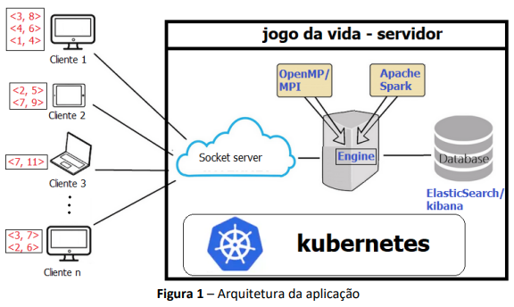
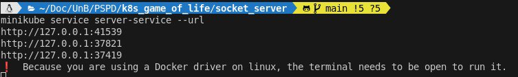
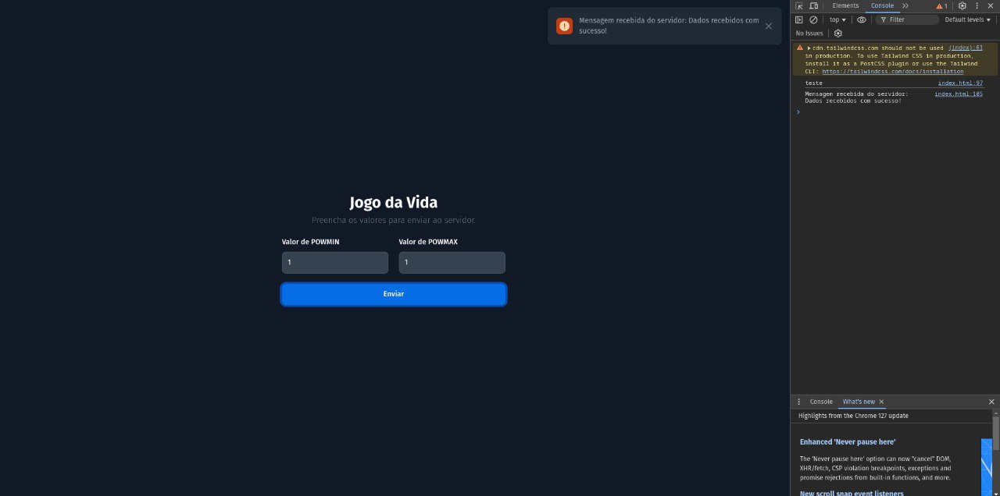

# Introdução

## 1. Kubernetes

Kubernetes é uma plataforma de orquestração de containers que automatiza o processo de implantar, gerenciar e escalar aplicações em containers. Containers encapsulam aplicações e suas dependências, tornando-as portáteis e consistentes, e o Kubernetes facilita a organização e execução desses containers em um ambiente distribuído.

### 1.1 Como Kubernetes Gerencia Containers

### 1.2 Camadas de Gerenciamento no Kubernetes

1- Pod: A menor unidade executável no Kubernetes. Um pod pode conter um ou mais containers que compartilham o mesmo armazenamento e rede. Containers em um pod são sempre executados juntos e, normalmente, trabalham de forma colaborativa.

2- Service: Define um endpoint estável (IP ou nome DNS) para um conjunto de pods, permitindo que eles sejam acessados por outras partes do sistema (internamente ou externamente). Isso é importante porque os pods podem ser recriados e substituídos, mudando seu endereço IP.

3- Deployment: Gerencia o ciclo de vida dos pods, facilitando a criação e o gerenciamento de múltiplas réplicas de pods. Permite escalonamento, atualizações, rollbacks (reverter para uma versão anterior) e monitoramento do status das implantações.

4- ReplicaSet: Garante que um número específico de réplicas de um pod estejam rodando em um determinado momento. Ele é gerenciado pelo Deployment, que mantém o controle das réplicas para garantir a alta disponibilidade.

5- ConfigMap: Fornece configuração externa para os pods, permitindo que você armazene dados de configuração separados da imagem do container.

6- Secret: Armazena dados sensíveis, como senhas, tokens ou chaves de criptografia, e os disponibiliza de forma segura para os pods.

7- Namespace: Um mecanismo de isolamento dentro de um cluster, permitindo que múltiplos grupos ou projetos usem o mesmo cluster sem interferir uns nos outros. Isso facilita o gerenciamento de recursos e controle de acesso.

8- Ingress: Gerencia o acesso externo ao cluster Kubernetes, fornecendo regras de roteamento para expor serviços para fora do cluster.

9- PersistentVolume (PV) e PersistentVolumeClaim (PVC): Fornecem mecanismos para armazenamento persistente. Os pods podem usar esses volumes para armazenar dados que precisam sobreviver a reinicializações.

## 2. Minikube

Minikube é uma ferramenta que permite criar e executar um cluster Kubernetes local em uma única máquina. Ele é especialmente útil para desenvolvimento e testes, oferecendo uma maneira rápida de experimentar com Kubernetes sem a necessidade de configurar um cluster completo em servidores remotos ou na nuvem.

### 2.1 Como Minikube cria esse cluster?

Para esse projeto, usamos a virtualização em containers (via drivers como Docker). Isso isola o Kubernetes do ambiente local.

Minikube configura um cluster de Kubernetes de nó único, o que significa que tudo roda na mesma máquina. Embora não seja adequado para produção, ele oferece todos os componentes necessários para testar e simular um cluster Kubernetes real.

### 2.2 Como usar o MiniKube?

1. Instalação: Baixar e instalar Minikube de acordo com o sistema operacional. Também é necessário um hipervisor ou Docker para virtualização.

2. Iniciar o Cluster: Executar minikube start, que irá inicializar o cluster Kubernetes local em uma VM ou contêiner.

3. Acessar o Cluster: Você pode interagir com o cluster Kubernetes usando o kubectl (a ferramenta de linha de comando para Kubernetes) para criar pods, services, e outros recursos.

4. Parar ou Deletar: Quando terminar de usar, você pode parar o cluster com minikube stop ou deletá-lo com minikube delete.

## 3. Kubectl

kubectl é a ferramenta de linha de comando para interagir e gerenciar clusters Kubernetes. Ele permite que você execute comandos para implantar, inspecionar, modificar e gerenciar recursos dentro do cluster Kubernetes. Essencialmente, kubectl é a interface principal para os desenvolvedores e administradores controlarem o comportamento de um cluster Kubernetes.

1. Instalação
Para instalar o kubectl, você pode seguir as instruções da documentação oficial do Kubernetes. A instalação varia de acordo com o sistema operacional (Linux, macOS, Windows).

2. Verificando o status do cluster
Comando: kubectl cluster-info
Descrição: Verifica o status geral do cluster e seus principais componentes.

3. Listar recursos
Comando: kubectl get <resource>
Exemplo: kubectl get pods
Exemplo: kubectl get services
Descrição: Exibe uma lista de recursos existentes no cluster. Você pode listar pods, serviços, namespaces, nodes, etc.
Exemplo: kubectl get pods lista todos os pods rodando no cluster.

4. Criar um recurso a partir de um arquivo YAML
Comando: kubectl apply -f <arquivo.yaml>
Exemplo: kubectl apply -f deployment.yaml
Descrição: Cria ou atualiza um recurso Kubernetes com base em um arquivo de configuração YAML. Arquivos YAML definem o estado desejado do recurso (pod, deployment, service, etc.).

5. Ver detalhes de um recurso específico
Comando: kubectl describe <resource> <name>
Exemplo: kubectl describe pod nginx-pod
Descrição: Fornece detalhes mais completos sobre um recurso específico, como eventos recentes, configurações e status.

6. Excluir um recurso
Comando: kubectl delete <resource> <name>
Exemplo: kubectl delete pod nginx-pod
Descrição: Remove o recurso especificado do cluster.

7. Escalar um Deployment
Comando: kubectl scale deployment <name> --replicas=<num>
Exemplo: kubectl scale deployment nginx-deployment --replicas=3
Descrição: Escala um deployment, ajustando o número de réplicas de pods.

8. Monitorar logs de um pod
Comando: kubectl logs <pod-name>
Exemplo: kubectl logs nginx-pod
Descrição: Exibe os logs gerados por um pod em execução.

9. Acessar um pod via linha de comando (execução interativa)
Comando: kubectl exec -it <pod-name> -- /bin/bash
Exemplo: kubectl exec -it nginx-pod -- /bin/bash
Descrição: Inicia um shell interativo dentro de um container em um pod.

10. Aplicar alterações em um recurso
Comando: kubectl apply -f <arquivo.yaml>
Exemplo: kubectl apply -f updated-deployment.yaml
Descrição: Aplica mudanças a um recurso existente com base nas configurações do arquivo YAML fornecido.

11. Obter informações detalhadas de um pod ou outro recurso em formato YAML
Comando: kubectl get <resource> <name> -o yaml
Exemplo: kubectl get pod nginx-pod -o yaml
Descrição: Mostra os detalhes do recurso em formato YAML, útil para revisar configurações e estado.

## Arquitetura



## 4. Como rodar o projeto:

O kubernetes, como gerenciador de containers, precisa da imagem do código para executar nos cluster. para isso temos algumas pastas com o código fonte do executável. para configurar basta segguir os seguintes passos:

### 4.1 Criar image do arquivo

Antes de qualquer coisa é importante configurar o docker par ambiente local com:

> eval $(minikube docker-env)

caso use docker-desktop:

> $ unset DOCKER_HOST

> $ kubectl config current-context 

Em cada pasta (omp, mip, spark, elastic_search, socket_server, client) executar:

> $ docker build -t   "nome_da_image" .

obs: "nome_da_imagem" de ter o mesmo nome contino na "image" do .yml:

exemplo: 

```yml

apiVersion: apps/v1
kind: Deployment
metadata:
  name: jogodavida-omp
spec:
  replicas: 2
  selector:
    matchLabels:
      app: jogodavida-omp 
  template:
    metadata:
      labels:
        app: jogodavida-omp
    spec:
      containers:
      - name: openmp-container
        image: omp-pspd
        imagePullPolicy: Never
        ports:
        - containerPort: 30005
        command: ["/app/jogo_da_vida_omp"]
```

### 4.2 Criar Cluster

Para criar o cluster recomendamos usar o "minikube" com o comando:

> $ minikube start

> $ minikube addons enable ingress

Um cluster kubernetes deve ser criado depois de alguns minutos com o nome "minikube".

Os comandos com kubectl deve começar a funcionar.

### 4.3 Aplicar o .yml no cluster para configura-lo com:

> $ kubectl apply -f pod.yml

o pod.yml é um compilado com todos os .yml

se isso não funcionar, dar apply em cada .yml separadamente.

### 4.4 Verificar estados dos pods

Para verificar estado dos pods você pode dar o comando:

> kubectl get pods

ou

> kubectl get pods -n my-app

caso tenha definido um namespace

### 4.5 achar portas e conectar no index.html

Se tudo estiver funcionando o próximo passo e descobrir a porta que ingress abriu para conectar com os pods do seu cluster. Para isso, basta rodar o comando:

> $ minikube service socket-service --url

> $ minikube service client --url



isso deve mostrar a porta ussadas pelo kubernetes. A ultima porta listada é do socket.

### 4.6 Substituir porta no client

Na pasta client, o index.html tem uma fun,ão para conectar no endereço do socket. substitua ela para poder conectar:

```.html
const socket = new WebSocket('ws://127.0.0.1:?????/');
let isConnectedToServer = false;
```

### 4.7 Testar aplicação

Se tudo estiver funcionado perfeitamente, é so enviar as mensagens para o servidor socker_server.



O comando minikube dashboard irá abrir uma dashboard no navegador que você pode analisar e testar a performance.

Complemento de:

https://github.com/senaarth/k8s_game_of_life